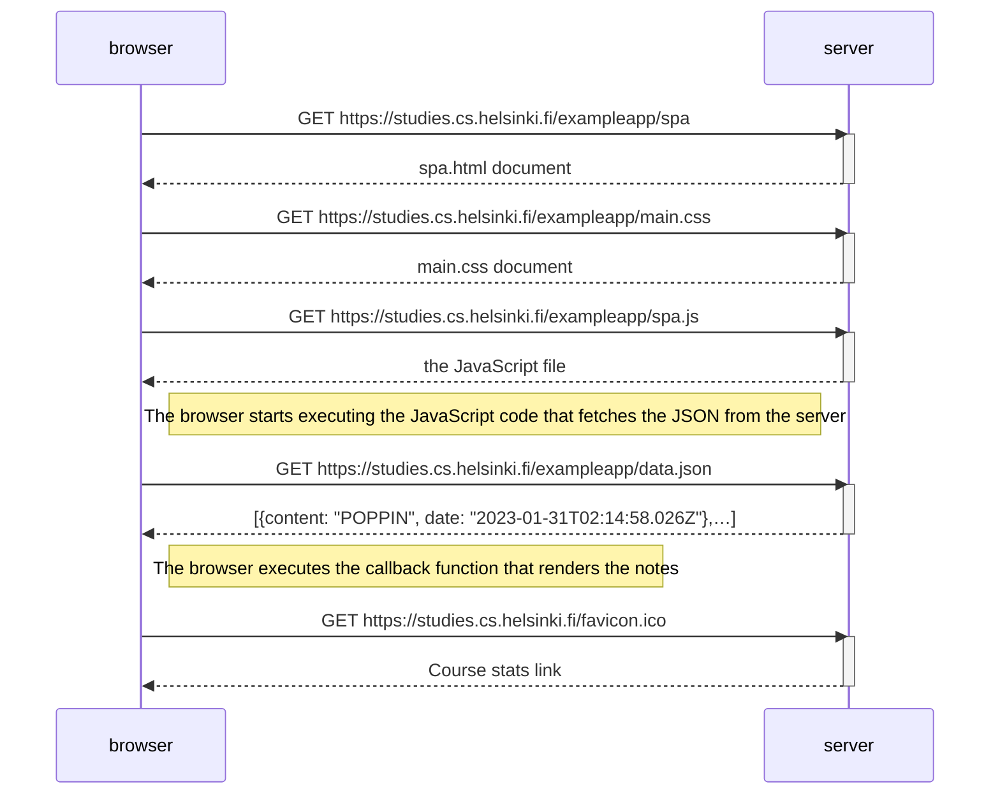

```mermaid

sequenceDiagram 
	participant browser
	participant  server

	browser->>server: GET https://studies.cs.helsinki.fi/exampleapp/spa
	activate server
   	server-->>browser: spa.html document
	deactivate server
	
	browser->>server: GET https://studies.cs.helsinki.fi/exampleapp/main.css
	activate server
   	server-->>browser: main.css document
	deactivate server
	
	browser->>server: GET https://studies.cs.helsinki.fi/exampleapp/spa.js
    	activate server
    	server-->>browser: the JavaScript file
    	deactivate server

    	Note right of browser: The browser starts executing the JavaScript code that fetches the JSON from the 		server

    	browser->>server: GET https://studies.cs.helsinki.fi/exampleapp/data.json
    	activate server
    	server-->>browser: [{content: "POPPIN", date: "2023-01-31T02:14:58.026Z"},…]
    	deactivate server    

    	Note right of browser: The browser executes the callback function that renders the notes 

	browser->>server: GET https://studies.cs.helsinki.fi/favicon.ico
    	activate server
    	server-->>browser: Course stats link
    	deactivate server
	
	
	
	
	
	
  
```
